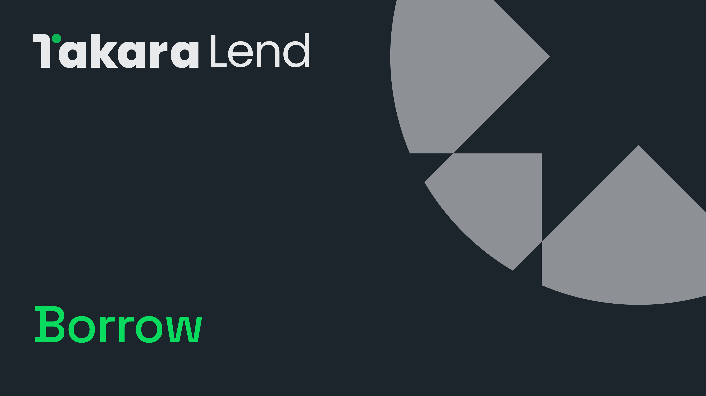

# 🤝 Borrow

<figure><figcaption></figcaption></figure>

Takara enables users to leverage or “collateralize” their digital assets to borrow other assets. By supplying assets to the Takara protocol, users can access over-collateralized loans.

The maximum borrowing capacity is determined by the value of the supplied collateral and the parameters defined by Takara Governance.

## **Supported Assets**



*  SEI (SEI)
*  iSEI (iSEI)
*  USDT (Tether USD)
*  USDC (USD Coin)
*  fastUSD (fastUSD)


