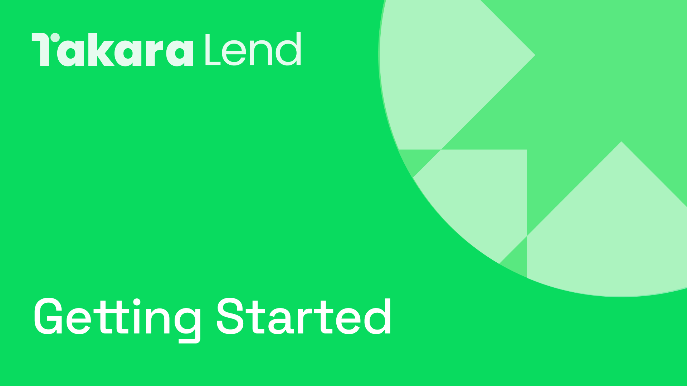

# 💠 Get started

<figure><figcaption></figcaption></figure>

To begin using Takara, the first step is to connect a wallet.

Takara is deployed on the Sei Networks V2, which is Ethereum Virtual Machine (EVM) compatible. This compatibility ensures that a broad spectrum of wallets can support Takara.

Upon [wallet connection](wallet-connection.md), users will have full access to the functionalities of Takara, including lending, borrowing, and staking.


If you are using the a Sei V1 wallet, you need to link your EVM & Sei addresses. This is necessary for Sei V2. [Learn more ↗](https://seistartguide.addpotion.com/)

